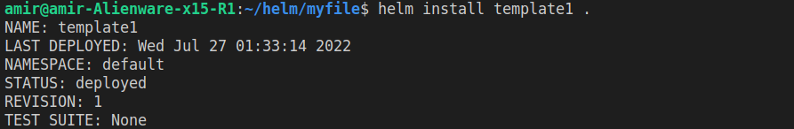
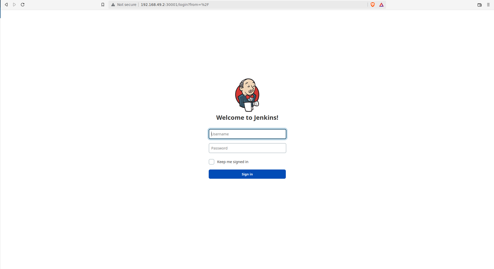
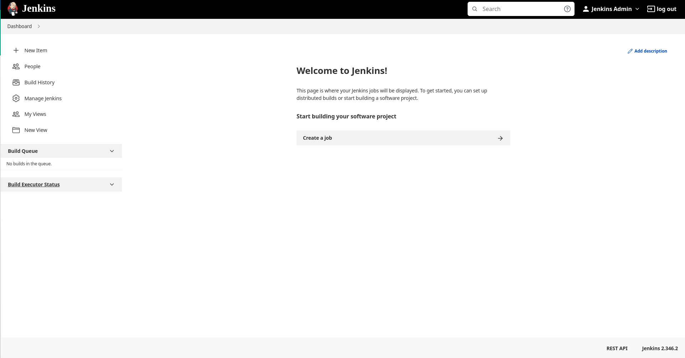

# Helm Lab

### 1. Create a helm chart for the app below and deploy it (please try to keep everything thing changeable using values.yaml)
```html
https://github.com/tradebyte/DevOps-Challenge
```
```bash
### First Create a helm folder
$ helm create myfile
```
```bash
### Create Deployment and service yaml files
```
```bash
### build using this helm command:
$ helm install [any-name] .
```

```bash
amir@amir-Alienware-x15-R1:~/helm/myfile$ kubectl get deployments
NAME                                  READY   UP-TO-DATE   AVAILABLE   AGE
monitoring-grafana                    1/1     1            1           132m
monitoring-kube-prometheus-operator   1/1     1            1           132m
monitoring-kube-state-metrics         1/1     1            1           132m
mydeploy                              1/1     1            1           31s
```
### 2. Deploy Jenkins Chart on the cluster and login to jenkins
```bash
### 1) Add jenkins repo using
$ helm repo add jenkins https://charts.jenkins.io
```
```bash
### 2) install the package
$ helm install [RELEASE_NAME] jenkins/jenkins
```
```bash
### 3) Run this command to ensure that the pods running well
$ kubectl get all
NAME               READY   STATUS    RESTARTS   AGE
pod/my-jenkins-0   2/2     Running   0          9m18s

NAME                       TYPE        CLUSTER-IP      EXTERNAL-IP   PORT(S)          AGE
service/kubernetes         ClusterIP   10.96.0.1       <none>        443/TCP          104m
service/my-jenkins         NodePort    10.106.12.92    <none>        8080:30001/TCP   9m18s
service/my-jenkins-agent   ClusterIP   10.103.248.44   <none>        50000/TCP        9m18s

NAME                          READY   AGE
statefulset.apps/my-jenkins   1/1     9m18s
```
```bash
### 4) change the service type from ClusterIP to NodePort using:
$ kubectl edit svc [RELEASE_NAME]
 # Please edit the object below. Lines beginning with a '#' will be ignored,
# and an empty file will abort the edit. If an error occurs while saving this file will be
# reopened with the relevant failures.
#
apiVersion: v1
kind: Service
metadata:
  annotations:
    meta.helm.sh/release-name: my-jenkins
    meta.helm.sh/release-namespace: default
  creationTimestamp: "2022-07-26T20:53:52Z"
  labels:
    app.kubernetes.io/component: jenkins-controller
    app.kubernetes.io/instance: my-jenkins
    app.kubernetes.io/managed-by: Helm
    app.kubernetes.io/name: jenkins
    helm.sh/chart: jenkins-4.1.13
  name: my-jenkins
  namespace: default
  resourceVersion: "1237"
  uid: 325f46e3-c24e-4cf7-b986-c9efe297fddc
spec:
  clusterIP: 10.106.12.92
  clusterIPs:
  - 10.106.12.92
  externalTrafficPolicy: Cluster
  internalTrafficPolicy: Cluster
  ipFamilies:
  - IPv4
  ipFamilyPolicy: SingleStack
  ports:
  - name: http
    nodePort: 30001
    port: 8080
    protocol: TCP
    targetPort: 8080
  selector:
    app.kubernetes.io/component: jenkins-controller
    app.kubernetes.io/instance: my-jenkins
  sessionAffinity: None
  type: NodePort
status:
  loadBalancer: {}
##############################################################################
```
```bash
### 5) Now you can access it through your browser using [minikubeIP:nodePort]
```


```bash
### 6) Now you need the username and password of your jenkins container
### to get the username:
$ helm show values jenkins/jenkins | grep adminUser
  # you should revert controller.adminUser to your preferred admin user:
  adminUser: "admin"
### to get the password:
$ echo $(kubectl get secret --namespace default my-jenkins -o jsonpath="{.data.jenkins-admin-password}" | base64 --decode)
xlhjlr7bWHA9kUwJlpV44R
```



### Another way:
```bash
### we can edit on the values.yaml and add our configuration there
### I added the values.yaml file with the new configuration and it gives the same answer as the previous
### you find it in the Q2 folder > values.yaml
```
```bash
### Run this command to set the values
$ helm upgrade my-jenkins1 jenkins/jenkins --values=values.yaml
```
